# Artwork One for Volumio

[](https://github.com/michaltamas/volumio-artwork-one/actions/workflows/ci.yml)
[](https://github.com/michaltamas/volumio-artwork-one/releases/latest)
[](LICENSE)

### Every record has a face. Artwork One gives it the whole screen.

Artwork One turns your [Volumio](https://volumio.com) player into something you want to look at. The cover of whatever is playing spills across the entire screen, softly blurred, and every control floats above it on frosted glass. The colours come straight from the artwork, so the interface changes its mood with every album: warm amber for one record, deep ocean blue for the next.

Beneath the new look sits everything you already rely on. Every source, every setting and every plugin Volumio offers is still there, with nothing hidden and nothing taken away. It lives on your player, installs with a single command, and feels at home wherever you meet your music: on the phone in your hand, a tablet on the sofa, a desktop browser, or a small touch screen next to your DAC.

- **Made for listening in high resolution.** Bit depth, sample rate, format and source, shown with pride instead of tucked away.
- **Three faces of Now Playing.** The cover, the words as they are sung, or who this is and what record — with the way into the library.
- **Listen in the browser.** With the companion [browser playback plugin](https://github.com/michaltamas/volumio-browser-playback), the phone in your hand becomes the speaker.
- **One fluid design.** No fixed breakpoints: it reshapes itself continuously for any screen, down to edge-to-edge on an iPhone.
- **Dark or light.** A paper theme beside the dark one, one choice for every screen of the player.
- **A display that rests.** After a while without a touch, the player's own screen shows the cover, the essentials and a clock, and comes back on touch.
- **Free to try.** One line to install, one click in Settings to switch back.

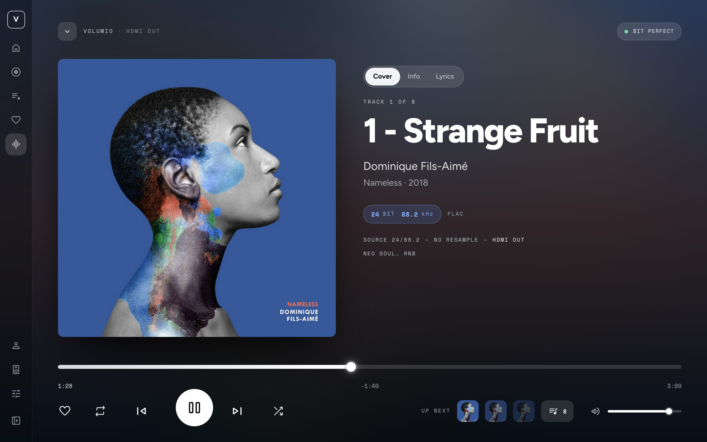

> **Coming from Artwork One 1.x or 2.x?** Those versions lived in [volumio-artwork-theme](https://github.com/michaltamas/volumio-artwork-theme), a fork of Volumio's AngularJS interface. Artwork One 3 is the same theme rebuilt from the ground up in React: the same look, faster, lighter, and with the features below that the old code base could not carry. Run the [installation command](#installation) on your player: it replaces the old version in place, keeps your settings and pins, and needs no other step.

---

## Table of contents

- [Features](#features)
- [Screenshots](#screenshots)
- [Requirements](#requirements)
- [Installation](#installation)
- [Updating](#updating)
- [Switching back and uninstalling](#switching-back-and-uninstalling)
- [Listening in the browser](#listening-in-the-browser)
- [Building from source](#building-from-source)
- [How it works](#how-it-works)
- [The plugin](#the-plugin)
- [Troubleshooting](#troubleshooting)
- [Known limitations](#known-limitations)
- [Credits](#credits)
- [Disclaimer](#disclaimer)
- [License](#license)

---

## Features

**Now Playing**
- Large cover next to the title, artist and album, sized to fill the screen at any window size.
- Three faces, switched above the title: **Cover**, **Info** and **Lyrics**. The title and the cover never leave; only the column beneath them changes.
- **Lyrics** from [LRCLIB](https://lrclib.net), synced to the music when the record has them: the line being sung is lit, the rest fades with distance, a tap on a line seeks to it. Plain words when that is all there is. On the phone the words slide up over the player as a panel.
- **Info**: who plays and what record. The artist with Wikipedia's one-line description, the year they began and the opening paragraph of their biography; the record with its label, year and track count. The facts come from [MusicBrainz](https://musicbrainz.org) and [Wikipedia](https://en.wikipedia.org); *Artist ›* and *Album ›* open their pages in the library.
- The real format as Volumio reports it: bit depth, sample rate, file type and streaming service (for example *24 BIT 192 kHz · FLAC · QOBUZ*), the path from the source to the output device including any resampling, and a *Bit perfect* badge when nothing touches the stream.
- A quality badge that says what the stream is at a glance — hi-res, DSD, lossless, lossy or radio — on Now Playing, in the mini player, in every track row and on the resting display.
- When something outside the player drives it — AirPlay, the analog input, another app, or a multiroom group this player follows — Now Playing says so in place of the signal path, and the mini player names the source.
- When nothing plays, Now Playing offers the way to music: *Browse*, *Search*, *Play the queue*, and the last tracks played, each one tap from playing again.
- A seek bar across the full width, with elapsed, remaining and total time. Drag the handle with the mouse or a finger, or step through the track with the arrow keys.
- *Up next* thumbnails that start the next tracks directly.
- A **sleep timer**: four presets or any number of minutes, stop the music or power the player off, the countdown on Now Playing and in the mini player while it runs.
- Opens from the mini player with a slide-up; closes with the chevron, or on the phone by pulling it down with a finger.

**Mini player**
- Cover, title, artist and a compact quality line (*24/192 · FLAC*), transport, seek bar, volume, the zone and output picker, and the queue button with the number of tracks.

**Queue**
- A floating panel instead of a separate page: drag to reorder, remove, shuffle, repeat, save as a playlist, clear, and the time the queue ends.
- **Play next** and **Play last** in every row's menu, with a toast that says where the track landed and an *Undo* while it shows.

**Library and sources**
- Home with *Pick up where you left off*, recently played albums and a shelf of **pins**: anything you keep going back to — a source, a folder, a playlist, an album, a station — pinned from its row menu, dragged into order, kept on the player so every screen shows the same shelf.
- Album and playlist pages with the cover beside the track list and a summary in the header — *2011 · POP · FLAC · 10 TRACKS · 47 MIN*, or *50 TRACKS · 2 H 47 MIN* for a playlist.
- Artist pages with albums and tracks, breadcrumbs, grid and list views, sorting, filtering and an A–Z index. The artists list says how many albums and tracks each has.
- One track list for every source — the library, Last 100, Favourites, Tidal, Spotify — with the same columns, the quality of each track and a favourite button.
- On a streaming service's pages the search field asks the service itself — Spotify's search in Spotify, Tidal's in Tidal — instead of filtering the rows on screen.
- Every Volumio source works as before: the music library, Web Radio, Spotify, Tidal, media servers and music service plugins.

**Zones and outputs**
- A Zones page and a picker in the mini player: this player, the other Volumio players on the network, multiroom groups with their volumes, and the audio outputs.
- **This browser** as an output, when the [browser playback plugin](#listening-in-the-browser) is installed.

**Navigation and settings**
- A side rail that opens into labels with one click and remembers it; your playlists one step away from it.
- A search field on the Settings landing (⌘K / Ctrl+K) that finds a page or a section of one by name — *resamp* leads straight to Audio Resampling — across Volumio's pages, the installed plugins' pages and the theme's own sections.
- Settings, plugin pages, MyVolumio, dialogs and notifications in the same visual language.

**The player's own display**
- *Ambient*: after a few minutes without a touch, a display the player drives (HDMI, the Touch Display plugin, a TV) shows the cover, the essentials and a clock — cover-led, clock-led or full-bleed — and comes straight back on touch. Night hours dim it; the composition drifts slowly against burn-in.
- One theme, one set of ambient settings and one shelf of pins for every screen of the player, kept on the player by the [plugin](#the-plugin): set them from a phone, the display follows at once.

**Everywhere**
- A fluid layout with no fixed breakpoints: it adapts continuously to phones, tablets, desktop browsers and unusual displays on media players.
- Phone layout with a menu sheet, swipe gestures and edge-to-edge display on iPhone, including the status bar colour.
- When the player cannot be reached — a restart, an update, a lost Wi-Fi — a *Connection lost* screen says so, counts how long, offers a reload after a minute, and gets out of the way the moment the player is back.
- Switching the interface in Volumio's settings reloads every open screen into the new one.
- Fonts and icons are served from the player, so the interface also works without internet access.

## Screenshots

| | |
|---|---|
| 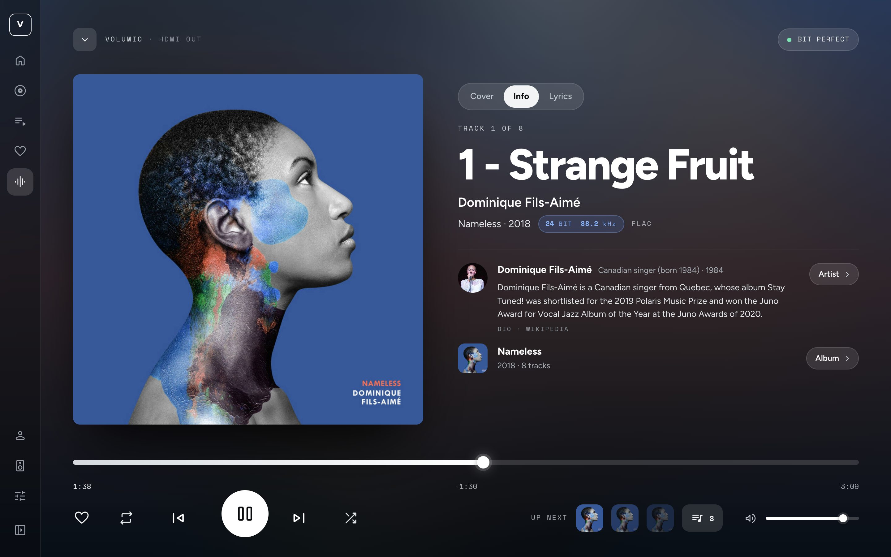 | 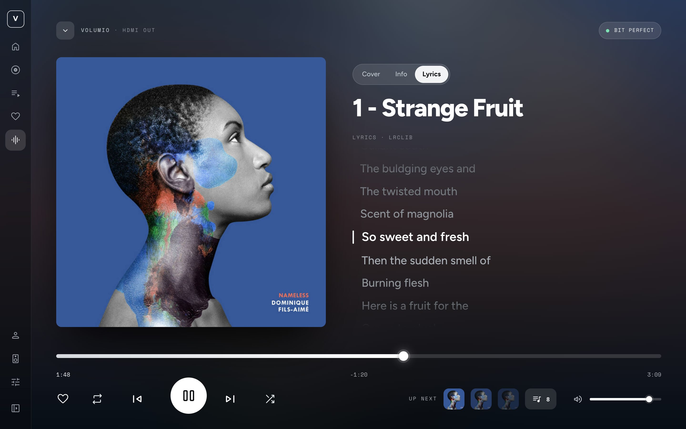 |
| **Info** — who plays and what record | **Lyrics** — the words as they are sung |
| 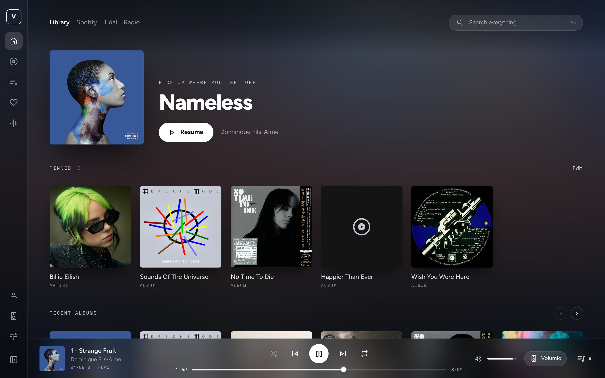 | 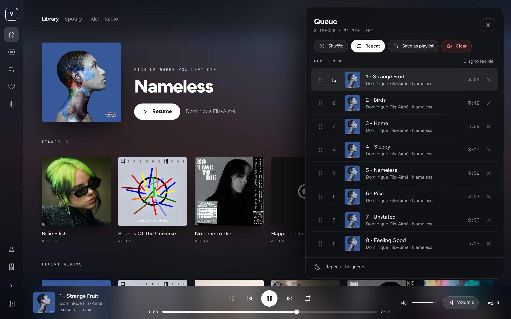 |
| **Home** — with the pinned shelf | **Queue** |
| 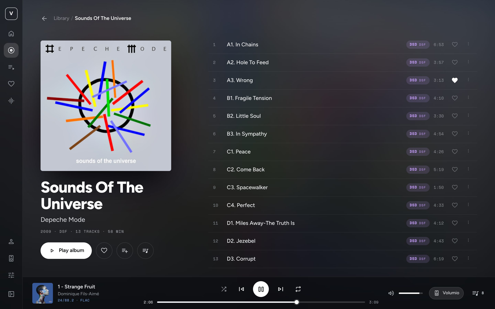 | 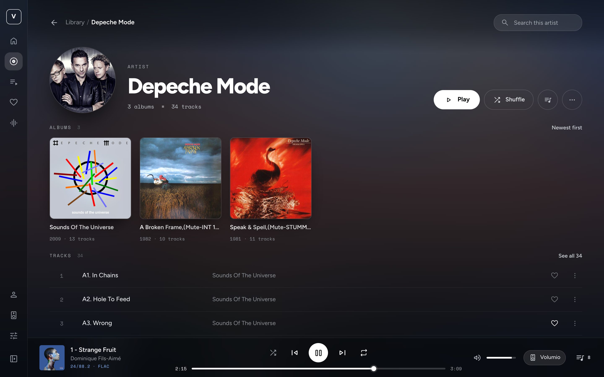 |
| **Album** | **Artist** |
| 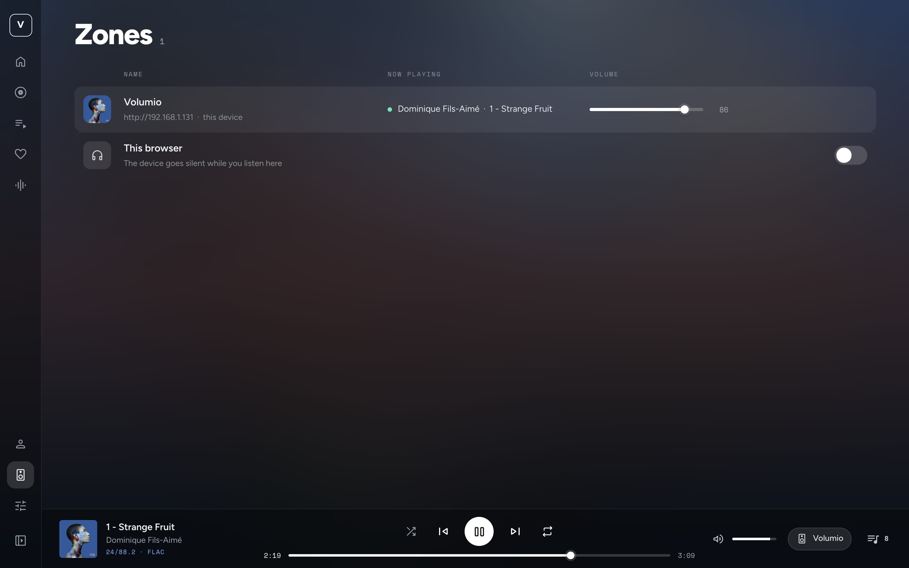 | 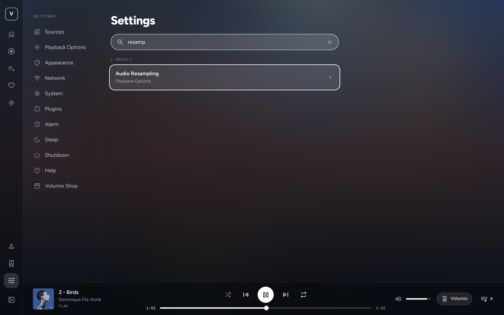 |
| **Zones** — with *This browser* | **Settings search** |
| 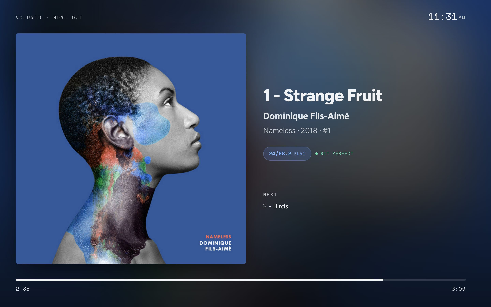 | |
| **Ambient** — the player's display at rest | |

<p align="center">
  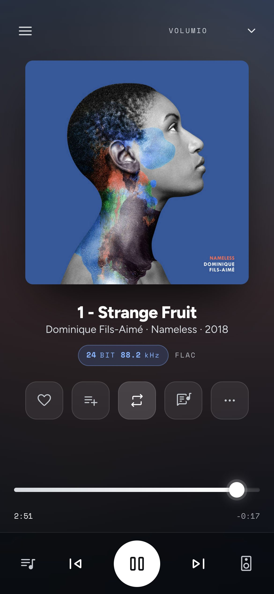
  &nbsp;&nbsp;
  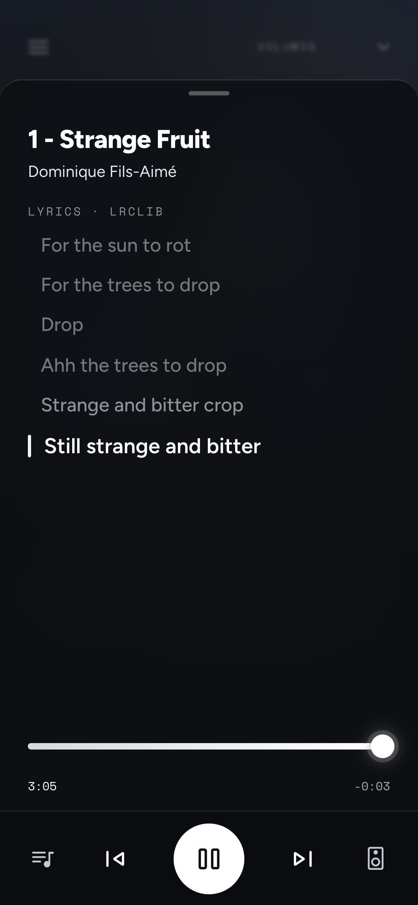
  &nbsp;&nbsp;
  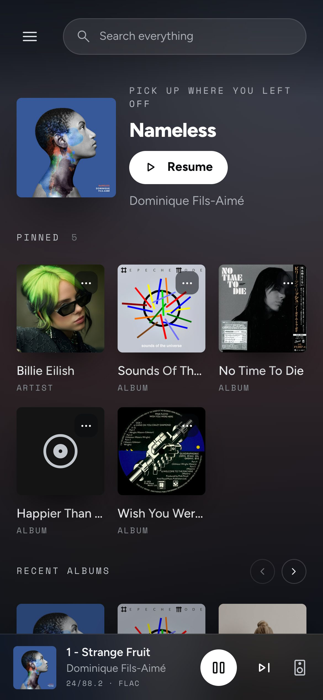
</p>

### The light theme

The same screens on paper. The cover still bleeds behind everything, but the veil over it runs up to a warm off-white instead of down to black, and the transport turns from a white disc with a dark glyph into an ink disc with a paper one. Pick **Dark**, **Light** or **System** in Settings → Appearance. Until something is picked the theme is dark.

The choice is the player's: every screen — the phone, the desktop browser, a display on HDMI that nobody can touch — shows the theme picked in Appearance, at once. Without the plugin the choice stays per browser, and a display can still be told with `?theme=light` (or `dark`, `system`) in the address it opens.

| | |
|---|---|
| 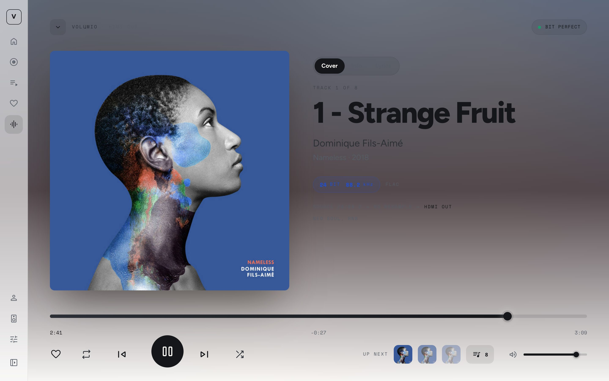 | 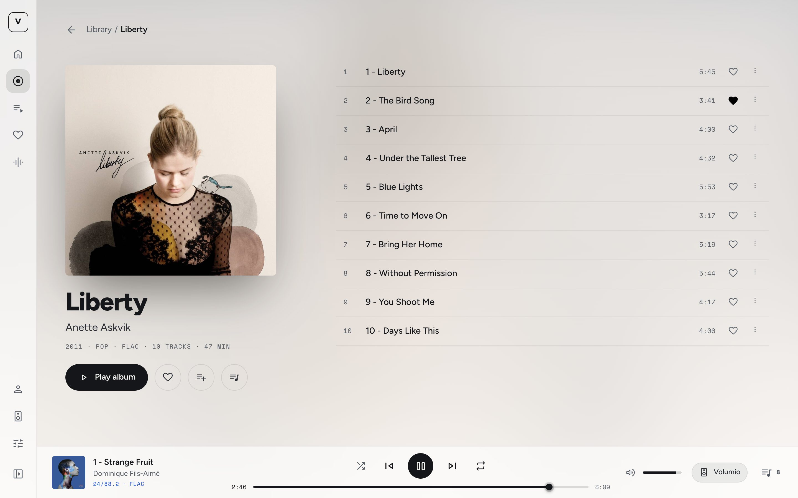 |
| **Now Playing** | **Album** |

<p align="center">
  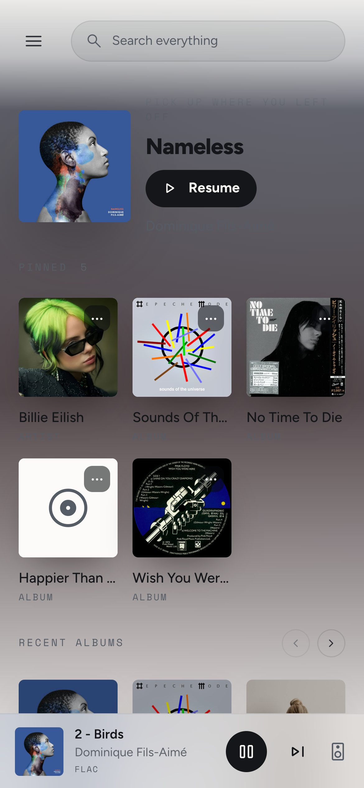
</p>

## Requirements

| | |
|---|---|
| Player | Volumio 4.x. Developed and tested on Volumio 4.119 on a Raspberry Pi 4 (Debian bookworm). |
| Access | SSH access to the player, once, for the installation |
| Network | The player needs internet access while installing, to download the release from GitHub |
| Browser | A current version of Chrome, Edge, Firefox or Safari, including Safari on iPhone and iPad |

## Installation

Artwork One is installed next to Volumio's own interfaces. Nothing is replaced, and you can switch back at any time from the settings.

1. **Enable SSH** on the player: open `http://volumio.local/dev` (or `http://<player-ip>/dev`) in a browser and switch SSH on. See Volumio's [SSH guide](https://developers.volumio.com/Device/ssh) for details.
2. **Connect** from a terminal. The default password is `volumio`:
   ```bash
   ssh volumio@volumio.local
   ```
3. **Install** the latest release:
   ```bash
   curl -fsSL https://raw.githubusercontent.com/michaltamas/volumio-artwork-one/main/scripts/install.sh | bash
   ```
4. **Select it** in the Volumio web interface: open **Settings → System**, choose **Artwork One** under *User Interface layout design* and press **Save**. The page reloads in the new interface.

To install and switch to it in one step, add `--activate`. Volumio restarts, then reload the page:

```bash
curl -fsSL https://raw.githubusercontent.com/michaltamas/volumio-artwork-one/main/scripts/install.sh | bash -s -- --activate
```

To install a particular version, pass `--version`, for example `bash -s -- --version v3.0.0`.

**What the installer does.** Artwork One is a Volumio plugin. The script downloads `artwork-one.tar.gz` from the [latest release](https://github.com/michaltamas/volumio-artwork-one/releases/latest), puts the plugin in `/data/plugins/user_interface/artwork_one` (the interface under `ui/`), registers it as enabled in Volumio's plugin list and restarts Volumio once; the plugin then registers the interface in Settings → System. With `--activate` it also makes it the active interface. It changes nothing under `/volumio`, and everything lives on the data partition, so it survives system updates. You are welcome to read [the script](scripts/install.sh) before running it. The same plugin is on its way to Volumio's plugin store, where it will install from Settings → Plugins without SSH.

**Upgrading from an earlier Artwork One** (1.x–3.1, installed to `/data/artwork-ui` with the Companion plugin) is the same command: the plugin takes over the interface entry and the settings — theme, ambient display, pins — and the older files and the Companion are removed.

## Updating

Run the installation command again. It replaces the files in place, so the interface keeps working while it updates; reload the page afterwards. To see which version is installed:

```bash
cat /data/artwork-ui/VERSION
```

## Switching back and uninstalling

To go back to Volumio's own interface, choose it under *User Interface layout design* in **Settings → System**. Artwork One stays installed and can be selected again later.

To remove it completely, run on the player:

```bash
curl -fsSL https://raw.githubusercontent.com/michaltamas/volumio-artwork-one/main/scripts/uninstall.sh | bash
```

If Artwork One is the active interface at that moment, the player switches back to its default interface and Volumio restarts.

## Listening in the browser

Artwork One can play the music on the device you are holding instead of the player's speakers: a phone in the garden, a laptop in another room. This needs the free [browser playback plugin](https://github.com/michaltamas/volumio-browser-playback), which streams what the player plays to the browser (AAC, or lossless FLAC) and silences the player meanwhile. Once it is installed, **This browser** appears on the Zones page and in the output picker; switch it on and the music follows you. Where the browser supports it, the lock screen of a phone shows the track and its controls drive the player.

## Building from source

You need [Node.js](https://nodejs.org) 20 or newer.

```bash
git clone https://github.com/michaltamas/volumio-artwork-one.git
cd volumio-artwork-one
npm ci
npm run build          # type check + production build into dist/
```

To work on it against a real player, name the player in `.env.development` and start the dev server:

```bash
echo 'VITE_VOLUMIO_HOST=http://volumio.local' > .env.development
npm run dev
```

To try a build on a player, package it and install it there with the same installer a release uses:

```bash
scripts/deploy.sh volumio@volumio.local              # install; select it in Settings yourself
scripts/deploy.sh volumio@volumio.local --activate   # install and switch to it
```

`deploy.sh` uses `ssh` and `scp`; set up key-based login first (`ssh-copy-id volumio@volumio.local`). To produce the plugin folder and the release archive from `dist/`:

```bash
scripts/package.sh v3.2.0        # writes build/artwork_one/ (the plugin, for Volumio's store) and artwork-one.tar.gz
npm test                         # the plugin's tests, test/plugin.test.cjs (node:test; kew and v-conf as dev dependencies)
```

Releases are built by [GitHub Actions](.github/workflows/ci.yml) from the tagged source and attached to the GitHub release automatically.

## How it works

Volumio serves its web interface as static files and talks to it over Socket.IO and a small REST API. Any folder registered in `/data/thirdPartyUisList.json` can be picked as the interface in **Settings → System**. Artwork One is such a folder: a React application built with Vite, which speaks the same Socket.IO API as Volumio's own interfaces, so it needs nothing on the player besides its own files.

| Path | What lives there |
|---|---|
| `src/core/` | The connection to the player (`socket.ts`, `api.ts`) and the state, one [zustand](https://github.com/pmndrs/zustand) store per concern under `store/` |
| `src/pages/` | The screens: Home, Browse, Now Playing, Queue, Zones, Settings, plugin pages, MyVolumio |
| `src/components/` | Shared pieces: the rail, the mini player, the queue panel, sheets, rows and tiles |
| `src/styles/` | The stylesheets; `tokens.scss` holds the design tokens — colours, radii, and the fluid type and spacing scales built on `clamp()` — and `phone.scss` the phone layout |
| `public/` | Fonts, icons and the few static files served as they are |
| `plugin/artwork_one/` | The Volumio plugin: `index.js` registers the interface and keeps its settings; `scripts/package.sh` puts the build under `ui/` |
| `scripts/` | Installer, uninstaller, deployment and packaging |

## The plugin

Artwork One is one Volumio plugin, `user_interface/artwork_one` ([`plugin/artwork_one`](plugin/artwork_one)). On start it registers the interface with Volumio (`registerThirdPartyUI`), so it appears under Settings → System → User Interface layout design; on stop or uninstall it takes the entry out again and, if Artwork One was the active interface, switches the player back to one of Volumio's own first. It also keeps what the interface cannot keep for itself — the theme, the ambient display settings and the pins — and pushes every change to all connected screens, so a choice made on the phone is on the living-room display a moment later.

- It has no dependencies of its own: Volumio's modules (`kew`, `v-conf`) are loaded from the player's core tree. `install.sh` downloads, builds and writes nothing.
- Volumio stops a plugin before updating it and starts it again only on its next start. Artwork One switches the player to one of Volumio's own interfaces while it is stopped, and comes back on its own once Volumio restarts — so after an update from the plugin store, restart Volumio (or switch the plugin off and on under Settings → Plugins).
- Its page under Settings → Plugins shows whether Artwork One is the active interface, with a *Switch to Artwork One* button; the settings themselves live under Settings → Appearance.
- Contract, over Volumio's `callMethod`: `user_interface/artwork_one` · `getSettings {}` answers the caller with `pushArtworkSettings`; `setSettings {theme?, ambient?, pins?}` saves and pushes `pushArtworkSettings` to every screen. The answer carries `plugin: "user_interface/artwork_one"`.

## Troubleshooting

| Symptom | What to do |
|---|---|
| *Artwork One* is missing from *User Interface layout design* in Settings → System | Check that `/data/thirdPartyUisList.json` lists it and that `/data/artwork-ui/index.html` exists. Running the installer again fixes both. |
| The page stays blank or looks half-styled after switching | Reload the page, bypassing the cache (Shift + reload), because the browser may still hold files from the previous interface. |
| The installer reports *download failed* | The player has no internet access, or GitHub is unreachable from it. Download `artwork-one.tar.gz` from the releases page on another computer, copy it to the player and run `install.sh --from artwork-one.tar.gz`. |
| *This browser* does not appear on the Zones page | Install the [browser playback plugin](https://github.com/michaltamas/volumio-browser-playback). |
| You cannot reach the settings any more to switch back | Run the uninstaller over SSH, or write another interface to `/data/active_volumio_ui` and run `volumio vrestart`. |
| Anything else | Open an [issue](https://github.com/michaltamas/volumio-artwork-one/issues) with your Volumio version, device, browser and a screenshot. |

## Known limitations

- Only tested on Volumio 4.x.
- Artwork One is not part of Volumio's built-in interface list, so installing it needs SSH once.
- The labels the theme introduces are in English only for now.
- Plugins that bring their own custom HTML pages keep their own look inside the theme.
- Lyrics and the Info face's facts come from the internet — LRCLIB, MusicBrainz and Wikipedia, asked by the browser directly, without keys or accounts. Without a connection those faces stay empty. Everything else works offline.

## Credits

- The [Volumio](https://volumio.com) team, whose player and interface this theme is made for, and the contributors to [Volumio2-UI](https://github.com/volumio/Volumio2-UI), where Artwork One began.
- Typefaces: [Figtree](https://github.com/erikdkennedy/figtree), [Space Mono](https://github.com/googlefonts/spacemono) and [Lato](https://www.latofonts.com), under the SIL Open Font License; icons: [Material Symbols](https://github.com/google/material-design-icons), under the Apache License 2.0. See [NOTICE.md](NOTICE.md).

## Disclaimer

This is an independent, unofficial project. It is not affiliated with, endorsed by, or supported by Volumio. Volumio is a trademark of its respective owner.

## License

Artwork One is released under the [MIT License](LICENSE) © Michal Tamas. The bundled fonts keep their own licenses, and a few files that come from Volumio are listed in [NOTICE.md](NOTICE.md).
